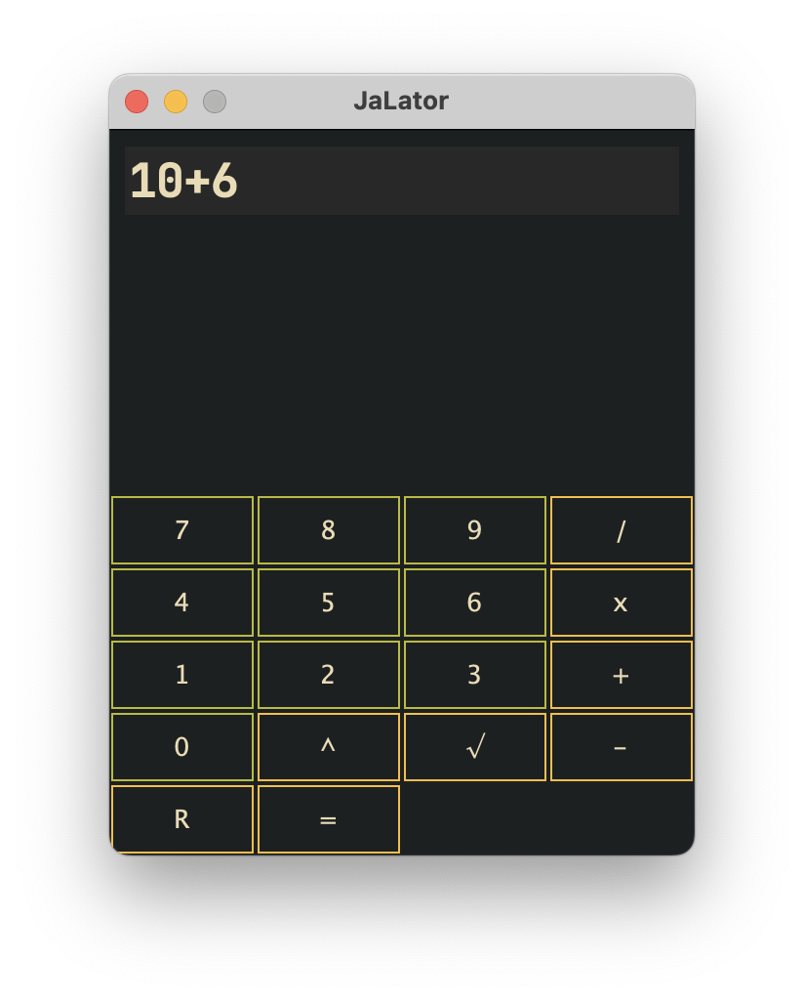

# JaLator

Simple java calculator I made for a school project.

It is very intuitive and easy to use but there are some limitations (for now). As an example you can only make 2 numbers operations, like -2+2, 0/3, -4+-4, √49 or 2^16.

## Dependencies

- jdk23

## Installation

(binaries soon)

