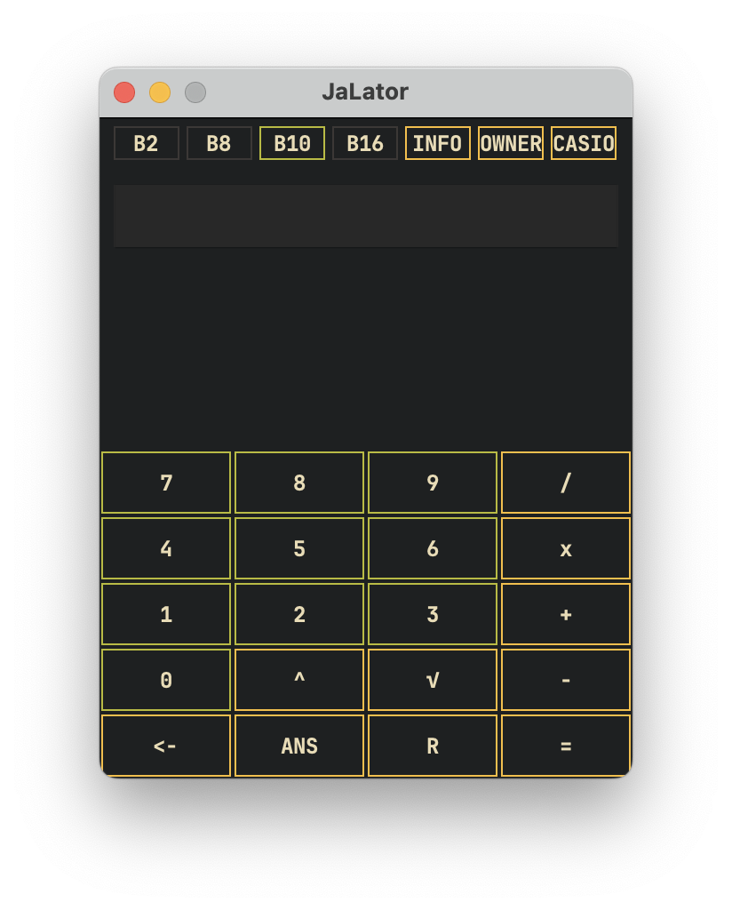

# JaLator



**JaLator** is a simple Java calculator created for a school project.  
It is intuitive and easy to use but currently has some limitations. For example, it only supports operations with two numbers at a time, such as `-2 + 2`, `0 / 3`, `-4 + -4`, `√49`, or `2^16`.

## Features

- Perform basic arithmetic operations: addition, subtraction, multiplication, division, and square root.
- Support for exponentiation with two numbers.
- Support for different base.

## Limitations

- Only two-number operations are supported.
  - Examples: `241 - 65` (valid), `241 - 65 + 10` (not supported).

## Requirements

- **Java Development Kit (JDK) 23** or later.

## Installation

1. Go to the [Releases](#) page and download the `.jar` file.
2. Ensure you have JDK 23 or a compatible Java runtime installed.

## Usage

1. Run the `.jar` file:
```bash
java -jar JaLator.jar
```

2. Use the calculator interface:
    - Press the buttons to input numbers and operations.
    - The calculator will compute the result based on the entered operation.

